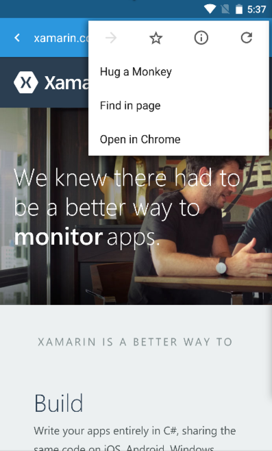

# Xamarin.ChromeCustomTabs

Google just announced the ability to use the Chrome browser's tabs within your own app at Google I/O 2015.

This is currently only available in Chrome for Android version 44 and higher, which as of the time of this document is available as the *Chrome Dev* app on the Play Store.



## Setup
Once you've installed the [*Chrome Dev*](https://play.google.com/store/apps/details?id=com.chrome.dev) app, you need to navigate to [chrome://flags](chrome://flags) and enable **Enable Hosted Mode**, and restart your browser.

## Loading a Page
You can load pages without any customization very easily:

```csharp
var hostedManager = new HostedActivityManager (this);
var uiBuilder = new HostedUIBuilder ();

hostedManager.LoadUrl ("http://google.com", uiBuilder);
```

## Customization
You can also customize the look and feel of the browser tab.  You can change the background colour of the toolbar, customize start and exit animations, add items to the overflow menu, and even add icons to the action bar!


```csharp
// Xamarin Blue
uiBuilder.SetToolbarColor (Color.Argb (255, 52, 152, 219));

// Customize animations
uiBuilder.SetStartAnimations (this, Resource.Animation.slide_in_right, Resource.Animation.slide_out_left);
uiBuilder.SetExitAnimations (this, Resource.Animation.slide_in_left, Resource.Animation.slide_out_right);
```
See the sample for more information about adding menu and action bar items.
